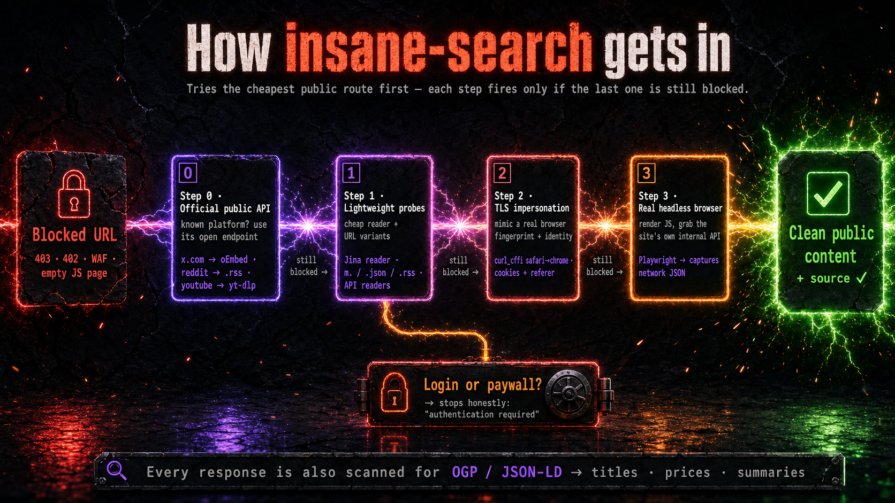

English | [한국어](README.ko.md) | [中文](README.zh.md) | [日本語](README.ja.md) | [Español](README.es.md)

<div align="center">

# insane-search

**Impossible is nothing. If it's public, insane-search gets in.**

A resilient public-page reader for Claude Code. No API keys, no proxy setup.

<p>
  <a href="https://docs.anthropic.com/en/docs/claude-code"></a>
  
  <a href="https://github.com/fivetaku/gptaku_plugins"></a>
  <a href="https://github.com/fivetaku/insane-search/stargazers"></a>
</p>

<!-- Hero — cinematic key-art: a blocked site (403 / CAPTCHA / WAF) shatters as
     insane-search breaks through and returns real public content with its source. -->


</div>

---

## New in v0.16.3

- **One fetch for content and trace:** `--json-content` returns metadata, trace, and wrapped untrusted text together, without fetching the same URL again for diagnostics. Existing `--json` output still omits the body.
- **Lazy PDF parsers:** `pdfplumber` and `pypdf` load only when PDF extraction is needed, not during ordinary HTML startup. PDF extraction and fallback behavior are preserved.

## ⚡ Install

```bash
/plugin marketplace add https://github.com/fivetaku/gptaku_plugins.git
/plugin install insane-search@gptaku-plugins
/reload-plugins
```

No commands to learn. Ask Claude Code normally — insane-search kicks in when a fetch gets blocked.

## 💬 Try it

Just ask normally — insane-search kicks in when a fetch gets blocked:

> *"Find what people are saying about Claude Code on Reddit and summarize the top threads."*
> *"Search X for posts about insane-search."*
> *"Summarize this YouTube video."*

**Expected:** Claude reaches each site's public route — Reddit's feed, X through free Brave/Yahoo discovery plus tweet-result validation, YouTube captions — with no login and no API key. If xAI credentials are already available, X keyword discovery is automatically augmented with native `x_search`; the free route remains active and can be forced with `INSANE_SEARCH_XAI=off`.

## 🌐 Works on

**X · Reddit · YouTube · Hacker News · Naver · Coupang · LinkedIn · Medium · Substack · arXiv · GitHub · Stack Overflow · Bluesky · Mastodon** — plus any site with a public page, feed, or `/rss`. Full platform list & methods → [PLATFORMS.md](PLATFORMS.md).

## ⚙️ Why it gets through

- **It escalates, never pre-judges** — public API readers → syndication gateways → TLS impersonation → a real headless browser, trying each route until one works.
- **It looks human** — builds a full browser identity (real TLS fingerprint, cookie warming, referer chain), not just a swapped User-Agent.
- **Zero setup** — auto-installs what it needs (`curl_cffi`, `yt-dlp`, …) on first use. No API keys, no signup.

## 🆚 Default Claude Code vs `+ insane-search`

| When you hit… | Claude Code alone | `+ insane-search` |
| :--- | :--- | :--- |
| A `403` / WAF-blocked page | ✖ gives up | ✓ escalates until one route gets through |
| Platform content (X, Reddit, HN) | ✖ often blocked or empty | ✓ public API readers + syndication |
| An anti-bot / CAPTCHA challenge | ✖ stops | ✓ TLS impersonation, then a real headless browser |
| A media page (YouTube, 1,800+ sites) | ✖ no transcript | ✓ `yt-dlp` metadata + captions |
| Missing tools (`curl_cffi`, `yt-dlp`) | — | ✓ auto-installs on first use |
| API keys / signup | — | ✓ none |
| A **login wall or paywall** | ✖ | ✖ **stops here, and says so** (see Boundaries) |

The differentiating row is the one thing the default fetcher can't do: **it keeps trying public routes until one works.**

## ✨ What just happened

| Without it | With insane-search |
| :--- | :--- |
| Ordinary fetch hits `403` and Claude says it can't read the page | The plugin picks a public-access route and returns usable text |
| You manually try mirrors, archives, mobile URLs | Fallbacks escalate automatically, public-only |
| A blocked page is a dead end | Metadata and structured data still yield titles, prices, summaries |

## 🔁 How it works



<details>
<summary><strong>Phase 0→3 adaptive scheduler — details</strong></summary>

Each phase runs only if the previous one fails or detects a blocking signal:

- **Phase 0** — special public endpoints (platform APIs, feeds) it can't discover generically
- **Phase 1** — lightweight probes: public API readers, syndication gateways, mobile / `.json` / `/rss` URL variants
- **Phase 2** — TLS impersonation (curl_cffi: safari → chrome → firefox) with a full browser identity
- **Phase 3** — a real headless browser for JS-rendered pages
- **Exit** — a login or paywall is detected: it reports *"authentication required"* rather than pretending

Every response is also scanned for OGP / JSON-LD, so even partial pages yield titles, summaries, and prices.
</details>

## 🔒 Boundaries

insane-search is a **reader for public content**, not a way around authentication.

- Reaches what's available through public pages, public APIs, feeds, archives, and a browser's public responses.
- **Stops at logins and paywalls** — it reports `authentication required` instead of trying to defeat them.
- Never logs in as you and never stores or transmits credentials.
- All routes use no-auth public endpoints and standard, documented techniques.
- **You are responsible** for lawful, authorized use — each site's Terms of Service, `robots.txt`, rate limits, and applicable law. This is a dual-use developer tool; see [DISCLAIMER.md](DISCLAIMER.md).

## License

MIT — see [DISCLAIMER.md](DISCLAIMER.md) for acceptable-use and user-responsibility terms.

---

<div align="center">

**Part of [gptaku-plugins](https://github.com/fivetaku/gptaku_plugins)** — Claude Code plugins that break through the walls everything else stops at.

</div>
